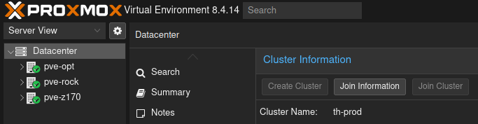

# Setup/Bootstrap

You need atleast one proxmox cluster to start (one host is enough). Later you can add multiple proxmox clusters to your pve cloud instance.

The cluster needs to meet these minimum requirements:

* seperate free vlan (proxmox cloud runs its own mandatory dhcp)
* 4 cores
* 32 gb of ram
* 500 gb of free disk space for vms
* subnet with at least 20 free allocatable addresses

## Development/Deployment machine

You need a development machine (preferably apt based distro) in the same subnet/vlan segment as your proxmox hosts for running playbooks and applying terraform configurations.

These machines need ssh access to the root user of your proxmox clusters. Generate / install a key and add it to `~/.ssh/authorized_keys` on one of the proxmox hosts (proxmox automatically syncs this file accross all hosts in a cluster).

Next install the following packages/tools on your development machine:

* `apt install avahi-utils` (with this we can discover our proxmox hosts and clusters, don't install if you are using the [fallback approach](bootstrap.md#cli-fallback-approach))
* python3 (+ recommended virtual env)
* [terraform](https://developer.hashicorp.com/terraform/install#linux)
* [kubectl](https://kubernetes.io/docs/tasks/tools/install-kubectl-linux/)
* [helm cli](https://helm.sh/docs/intro/install/) ( `>=v3.0.0` )
* [yq (mikefarah)](https://github.com/mikefarah/yq?tab=readme-ov-file#install)
* `apt install direnv` (.envrc files for terraform conf/auth)
* nfs-common (if you want to use caching of setup artifacts)
* [docker](https://docs.docker.com/engine/install/) (if you want to use caching / [tdd development](tdd.md))


## Choose your proxmox cloud domain

Proxmox cloud uses KEA DHCP + DDNS for hostnames into bind. Any lxc/vm that is created will automatically be resolvable via its hostname through the BIND DNS server proxmox cloud deploys.

For this and for service identification we need a unique domain, that should not overlap / be used with other services you host.

Domains for services like for example `gitlab.example.com` can be added later in our cluster definition files. The cloud domain should be something like `your-cloud.example.com`.


## Setup Proxmox host discovery

The recommended approach for discovering your proxmox hosts from your development machine is [avahi](https://avahi.org/). If you encounter limitations in your network setup, you can also defer to the [fallback approach](bootstrap.md#cli-fallback-approach) using `pvcli connect-cluster`.

We need to make the proxmox cluster discoverable, for that run `apt install avahi-daemon` on one proxmox host of your choice.

Next create an avahi service file (`/etc/avahi/services/pxc.service`) on the host with the following content:

```xml
<?xml version="1.0" standalone='no'?><!--*-nxml-*-->
<!DOCTYPE service-group SYSTEM "avahi-service.dtd">

<service-group>

  <name replace-wildcards="yes">Proxmox host %h</name>

  <service protocol="ipv4"><!-- currently proxmox cloud only supports ipv4-->
    <type>_pxc._tcp</type>
    <port>22</port>
    <txt-record>cloud_domain=your.cloud.domain</txt-record><!-- insert your cloud domain here!-->
    <txt-record>cluster_name=your-cluster</txt-record><!-- insert your proxmox cluster name here (from proxmox ui - see screenshot)!-->
  </service>

</service-group>
```



Then simply run `service avahi-daemon reload` and now we can discover our host. You can validate the discovery by running `avahi-browse -rpt _pxc._tcp` on your development machine. 

Depending on how you do your vlan segmentation you either need the firewall to act as an mdns repeater (most firewall support repetition accross interfaces/ports) or create a dedicated reflector vm/lxc that has an interface in both vlans.

## Bootstrap

Create a git repository for your cloud instance for example company-xyz-cloud and setup your environment:

* create a venv `python3 -m venv ~/.pve-cloud-venv` and activate `source ~/.pve-cloud-venv/bin/activate`
* install `pip install ansible==9.13.0`
* create `requirements.yaml` in your repository like this (get versions from [here](index.md#compatibility)):
```yaml
---
collections:
  - name: pxc.cloud
    version: $LATEST_TAG_VERSION
  - name: https://github.com/kubernetes-sigs/kubespray
    type: git
    version: $MATCHING_KUBESPRAY_VERSION
```
* run `ansible-galaxy install -r requirements.yaml`, and run the setup playbook `ansible-playbook pxc.cloud.setup_control_node` to setup your local machine (this setup playbook has to be run on an upgrade of the collection aswel!)
* create a `ansible.cfg` file on the top level of your repo with the following content:
```ini
[defaults]
# on recreating vms this will prevent issues executing the playbook
host_key_checking = False

[inventory]
# this is needed so that if our custom inventory plugins raise an error
# playbook execution gets halted
any_unparsed_is_failed = True
```

## CLI Fallback Approach

After you have finished the setup of your python venv and ran the `ansible-playbook pxc.cloud.setup_control_node` you should have the cli tool `pvcli` available to you.

Connect to your one proxmox clusters `pvcli connect-cluster --pve-host $PROXMOX_HOST` (run once per cluster, per cloud domain).

The cli will ask you for a cloud domain if the cluster has not already one assigned.


### Repository setup

As in the [samples/cloud-instance](https://github.com/Proxmox-Cloud/pve_cloud/tree/master/samples/cloud-instance) your repository that defines the core pve cloud components you need:

* pve cloud inventory file - [cloud schema](schemas/pve_cloud_inv_schema.md) => for the `pxc.cloud.setup_pve_clusters` playbook
* lxc inventory files for the basic services - [lxc inv schema](schemas/lxc_inv_schema.md)
  * inventory for two kea lxcs => for use with `pxc.cloud.setup_kea` playbook - [dhcp inv schema](schemas/setup_kea_schema_ext.md)
  * inventory for two bind lxcs => `pxc.cloud.setup_bind` playbook - [bind inv schema](schemas/setup_bind_schema_ext.md)
  * three lxcs for patroni postgres => `pxc.cloud.setup_postgres` playbook - no special schema
  * two haproxy lxcs => `pxc.cloud.setup_haproxy` playbook - [haproxy inv schema](schemas/setup_haproxy_schema_ext.md)

From here you can start deploying your first kubernetes cluster, which will serve as the basis for most deployments/services.


