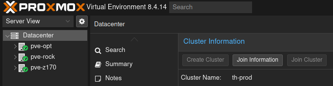

# Setup/Bootstrap

You need a development machine (preferably apt based distro) in the same subnet/vlan segment as your proxmox hosts for running playbooks and applying terraform configurations. If you come from the dedicated setups you will already have your [control node lxc](proxmox-setup/demo.md#control-node-ansibleterraform).

This can also be an lxc created manually on your proxmox cluster.

This machine needs root ssh access to your proxmox clusters. Generate / install a key (`ssh-keygen -t ed25519`) and add it to `~/.ssh/authorized_keys` on one of the proxmox hosts (simply copy the `id_ed25519.pub` files contentto one host, proxmox automatically syncs this file accross all hosts in a cluster).

Next install the following packages/tools on your development machine (most of these can be comfortably installed using [brew](https://brew.sh/)):

* `apt install avahi-utils` (with this we can discover our proxmox hosts and clusters, don't install if your network doesn't support mdns discovery and you need to use the [fallback approach](bootstrap.md#cli-fallback-approach))
* `apt install python3 python3-venv` 
* [terraform](https://developer.hashicorp.com/terraform/install#linux)
* [kubectl](https://kubernetes.io/docs/tasks/tools/install-kubectl-linux/)
* [helm cli](https://helm.sh/docs/intro/install/) ( `>=v3.0.0` )
* [yq (mikefarah)](https://github.com/mikefarah/yq?tab=readme-ov-file#install)
* `apt install direnv` (.envrc files for terraform conf/auth) - you also need to add `eval "$(direnv hook bash)"` to the end of your `~/.bashrc`
* [age](https://github.com/FiloSottile/age) if you want to use encrypted secrets in your infra strucutre as code repositories - [pxc_cloud_age_secret resource](https://registry.terraform.io/providers/Proxmox-Cloud/pxc/latest/docs/resources/cloud_age_secret)
* nfs-common (if you want to use caching of setup artifacts)
* [docker](https://docs.docker.com/engine/install/) (if you want to use caching / [tdd development](tdd.md))

## Choose your proxmox cloud domain

Proxmox cloud uses KEA DHCP + DDNS for hostnames into bind. Any lxc/vm that is created will automatically be resolvable via its hostname through the BIND DNS server proxmox cloud deploys.

For this and for service identification we need a unique domain, that should not overlap / be used with other services you host.

Domains for services like for example `gitlab.example.com` can be added later in our cluster definition files. The cloud domain should be something like `your-cloud.example.com`.

## Setup Proxmox host discovery

The recommended approach for discovering your proxmox hosts from your development machine is [avahi](https://avahi.org/). If you encounter limitations in your network setup, you can also defer to the [fallback approach](bootstrap.md#cli-fallback-approach) using `pvcli connect-cluster`.

We need to make the proxmox cluster discoverable, for that run `apt install avahi-daemon` on one proxmox host of your choice.

Next create an avahi service file (`/etc/avahi/services/pxc.service`) on the host with the following content:

```xml
<?xml version="1.0" standalone='no'?><!--*-nxml-*-->
<!DOCTYPE service-group SYSTEM "avahi-service.dtd">

<service-group>

  <name replace-wildcards="yes">Proxmox host %h</name>

  <service protocol="ipv4"><!-- currently proxmox cloud only supports ipv4-->
    <type>_pxc._tcp</type>
    <port>22</port>
    <txt-record>cloud_domain=your.cloud.domain</txt-record><!-- insert your cloud domain here!-->
    <txt-record>cluster_name=your-cluster</txt-record><!-- insert your proxmox cluster name here (from proxmox ui - see screenshot)!-->
  </service>

</service-group>
```



Also set `use-ipv6=no` and `allow-interface=MGMT-IFACE` under the `[server]` section in `/etc/avahi/avahi-daemon.conf`.

Then simply run `service avahi-daemon restart` and now we can discover our host. You can validate the discovery by running `avahi-browse -rpt _pxc._tcp` on your development machine. 

Depending on how you do your vlan segmentation you either need the firewall to act as an mdns repeater (most firewall support repetition accross interfaces/ports) or create a dedicated reflector vm/lxc that has an interface in both vlans.

## Cloud Repository

Create a git repository for your cloud instance for example company-xyz-cloud and setup your environment:

* create a python virtual environment, activate it and install ansible
```bash
python3 -m venv ~/.pve-cloud-venv
source ~/.pve-cloud-venv/bin/activate
pip install ansible==9.13.0 distlib==0.4.0
```
* create `requirements.yaml` in your repository like this (get versions from [here](index.md#compatibility)):
```yaml
---
collections:
  - name: pxc.cloud
    version: $LATEST_TAG_VERSION
  - name: https://github.com/kubernetes-sigs/kubespray
    type: git
    version: $MATCHING_KUBESPRAY_VERSION
```
* run `ansible-galaxy install -r requirements.yaml`, and run the setup playbook `ansible-playbook pxc.cloud.setup_control_node` to setup your local machine (this setup playbook has to be run on an upgrade of the collection aswell!)
* create a `ansible.cfg` file on the top level of your repo with the following content:
```ini
[defaults]
# on recreating vms this will prevent issues executing the playbook
host_key_checking = False

[inventory]
# this is needed so that if our custom inventory plugins raise an error
# playbook execution gets halted
any_unparsed_is_failed = True
```

### CLI Fallback Approach

If you network limits mdns you can still work with the collection, at the cost of having to manage proxmox inventories on each development machine. This is almost certainly needed on dedicated hosting providers.

After you have finished the setup of your python venv and ran the `ansible-playbook pxc.cloud.setup_control_node` you should have the cli tool `pvcli` available to you.

Run `pvcli connect-cluster --pve-host $PROXMOX_HOST` to connect to one of your proxmox clusters / set them up to be part of your proxmox cloud instance (run once per cluster, per cloud domain). For dedicated systems pass the parameter `--mgmt-iface`, set to vmbr0.X depending on where the interface was configured.

The cli will ask you for a cloud domain if the cluster has not already one assigned.

With this approach its up to you to keep the inventory on your developer machine in sync. To refresh the local inventory, after you added a new host to a cluster, simply run the `connect-cluster` command again, also passing the `--force` flag to update it.

### Inventory files

Have a look at the [cloud instance sample repository](https://github.com/Proxmox-Cloud/pve_cloud/tree/master/samples/cloud-instance) to see what proxmox cloud looks like in action.

It is recommended counting backwards from the end of your vm data network while assinging static ips for your service lxcs.

The code for your infrastructure will live inside a git repository that needs the following definitions:

* pve cloud inventory file - [cloud schema](schemas/pve_cloud_inv_schema.md) => for the `pxc.cloud.setup_pve_clusters` playbook
* lxc inventory files for the basic services - [lxc inv schema](schemas/lxc_inv_schema.md)
  * inventory for two kea lxcs => for use with `pxc.cloud.setup_kea` playbook - [dhcp inv schema](schemas/setup_kea_schema_ext.md)
  * inventory for two bind lxcs => `pxc.cloud.setup_bind` playbook - [bind inv schema](schemas/setup_bind_schema_ext.md)
  * three lxcs for patroni postgres => `pxc.cloud.setup_postgres` playbook - no special schema
  * two haproxy lxcs => `pxc.cloud.setup_haproxy` playbook - [haproxy inv schema](schemas/setup_haproxy_schema_ext.md)


## Ingress / Control Plane Forwarding

Now that you have chosen the internal ips of your services we need to forward external traffic to the selected adresses.

The main goal is to have an external ipv4 address that forwards traffic from tcp 80,443,6443 to our external floating ips.

### Demo system

If you are just setting up a demo system you only need to forward on the proxmox hosts level to the haproxy. You don't need to bother with any firewall settings.

For that add post-up rules:
```bash
iface vmbr0 inet static
        # ...

        # forward http, https, kubeapi
        post-up iptables -t nat -A PREROUTING -i vmbr0 -p tcp -d PUBLIC_IP_OF_PVE_HOST --dport 443 -j DNAT --to-destination HAPROXY_INTERNAL_FLOATING_IP:443
        post-down iptables -t nat -D PREROUTING -i vmbr0 -p tcp -d PUBLIC_IP_OF_PVE_HOST --dport 443 -j DNAT --to-destination HAPROXY_INTERNAL_FLOATING_IP:443

        post-up iptables -t nat -A PREROUTING -i vmbr0 -p tcp -d PUBLIC_IP_OF_PVE_HOST --dport 80 -j DNAT --to-destination HAPROXY_INTERNAL_FLOATING_IP:80
        post-down iptables -t nat -D PREROUTING -i vmbr0 -p tcp -d PUBLIC_IP_OF_PVE_HOST --dport 80 -j DNAT --to-destination HAPROXY_INTERNAL_FLOATING_IP:80

        post-up iptables -t nat -A PREROUTING -i vmbr0 -p tcp -d PUBLIC_IP_OF_PVE_HOST --dport 6443 -j DNAT --to-destination HAPROXY_INTERNAL_FLOATING_IP:6443
        post-down iptables -t nat -D PREROUTING -i vmbr0 -p tcp -d PUBLIC_IP_OF_PVE_HOST --dport 6443 -j DNAT --to-destination HAPROXY_INTERNAL_FLOATING_IP:6443
```

After that reboot / run `systemctl restart networking`.

### Dedicated systems

For dedicated remote systems we have setupped an opnsense software firewall, this will be the central gateway for allowing traffic into our cluster. For that we create forwarding rules pointing to the dedicated floating ip of our central HAProxy:

* 80,443 Traffic => this will be SNI filtered and distributed to our clusters
* 6443 => Exposing kubernetes control planes of our cluster
* Custom Ports for example 5432 for postgres => will route via the haproxy to kubernetes Nodeport / VM / LXCs

To create the rules do the following in the opnsense ui:

1. Open a host forwarding to one of your proxmox hosts and from there to the opnsense
3. Go to Firewall/NAT/Destination NAT, hit the little + Icon
4. Create Entries with the following settings: Interface: WAN, Protocol: TCP, Destination Address: This Firewall, Destination Port: 80, 443, 6443 (one rule for each), Redirect Target IP: Single host or Network - External Floating ip of you Proxmox Cloud Haproxy, Redirect Target Port: Same as Destination Port
5. Goto Firewall/Rules (New), again hit the little + Icon
6. Create Rules with the following settings: Interface: WAN, Action: Pass, Direction: In, Protocol: TCP, Destination Address: External Floating ip of you Proxmox Cloud Haproxy, Destination Port: 80, 443, 6443 (one rule for each)

If you dont have a dedicated external ip, you need to setup forwarding from the public ips of your proxmox hosts to your pseudo opnsense wan ip:

```bash
# again add as post-up to /etc/network/interfaces vmbr0

iface vmbr0 inet static
        # ...

        # forward http, https, kubeapi
        post-up iptables -t nat -A PREROUTING -i vmbr0 -p tcp -d PUBLIC_IP_OF_PVE_HOST --dport 443 -j DNAT --to-destination OPNSENSE_WAN_IP:443
        post-down iptables -t nat -D PREROUTING -i vmbr0 -p tcp -d PUBLIC_IP_OF_PVE_HOST --dport 443 -j DNAT --to-destination OPNSENSE_WAN_IP:443

        post-up iptables -t nat -A PREROUTING -i vmbr0 -p tcp -d PUBLIC_IP_OF_PVE_HOST --dport 80 -j DNAT --to-destination OPNSENSE_WAN_IP:80
        post-down iptables -t nat -D PREROUTING -i vmbr0 -p tcp -d PUBLIC_IP_OF_PVE_HOST --dport 80 -j DNAT --to-destination OPNSENSE_WAN_IP:80

        post-up iptables -t nat -A PREROUTING -i vmbr0 -p tcp -d PUBLIC_IP_OF_PVE_HOST --dport 6443 -j DNAT --to-destination OPNSENSE_WAN_IP:6443
        post-down iptables -t nat -D PREROUTING -i vmbr0 -p tcp -d PUBLIC_IP_OF_PVE_HOST --dport 6443 -j DNAT --to-destination OPNSENSE_WAN_IP:6443
```