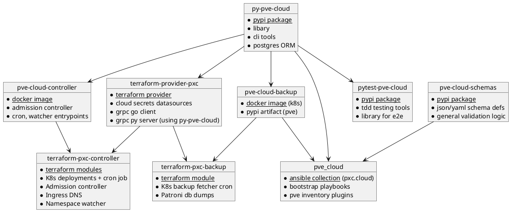

# Cloud Architecture

The collection is made of the following artifacts, you can find all the repositories in our github org.

## Terminology

The collection and projects use certain terms to define scope, which enables a lot of implicit behaviour.

* `pve_cloud_domain`: this is the main domain name you select for your cloud instance. Think of it as having one personal aws per domain.
* `target_pve`: this refers to a proxmox cluster within a domain. Its the result of the proxmox cluster name defined in the proxmox ui + `(.)pve_cloud_domain`
* `stack_name`: each set of vms / lxcs you deploy is referred to as a stack. Each kubespray cluster is its own stack also.
* `stack_fqdn`: this referes to the `stack_name` + `(.)pve_cloud_domain` and serves to identify the stack uniquely
