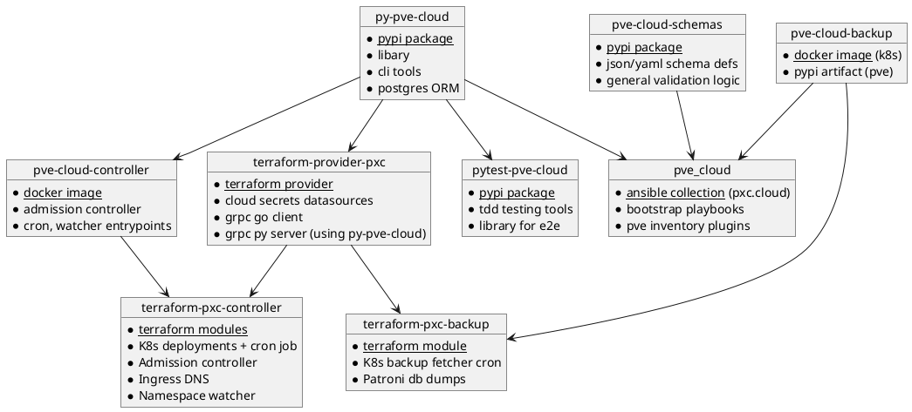

# General

This project aims to provide a self hosted cloud platform, giving you the same features like (AWS, Google Cloud, Azure), without being tied to any single one of them and their ridiculous prices.

All you need is a [Proxmox cluster](https://proxmox.com/en/) that can either run on your own hardware or on any rented dedicated server, of which there are hundreds of fairly priced options.

It is not a opinionated, monolithic solution - instead it aims to give your freedom to implement according to your needs and preferences, while as a preconfigured, solid foundation.

To work with this collection, basic understanding of the following tools / concepts is required:

* python and ansible
* terraform
* containerization and orchestration (k8s)
* virtualization (proxmox)
* networking, dhcp and dns (kea, bind)

## Quickstart

Checkout the [samples directory](https://github.com/Proxmox-Cloud/pve_cloud/tree/master/samples) to get an idea about how the collection works in action.

### Project dependency structure

## Compatibility

Verified working versions:

| Collection Version | Kubespray Version     | Debian LXC Version | PVE Version | Ceph Version |
| ------------------ | --------------------- | ------------------ | ----------- | ------------ |
| 3.6.X              | v2.28.0 (k8s 1.32.5)  | 12.12-1            | 8.4.12      | 19.2.2       |

