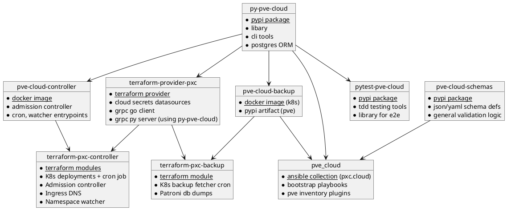

# General

This project aims to provide a self hosted cloud platform, giving you the same features (DNS, Load Balancing, Managed Kubernetes, ACME Certificates) like AWS, Google Cloud, Azure, without being tied to any single one of them and their ridiculous prices. 

You need [Proxmox cluster](https://proxmox.com/en/) that can run on your own hardware or on any rented dedicated server, of which there are hundreds of fair priced options (often 5-10x cheaper than what AWS & Co are offering).

It is not a opinionated, monolithic solution - instead it aims to give your freedom to implement according to your needs and preferences, while as a preconfigured, solid foundation.

To work with this collection, basic understanding of the following tools / concepts is required:

* python and ansible
* terraform
* containerization and orchestration (k8s)
* virtualization (proxmox)
* networking, dhcp and dns (kea, bind)

## Quickstart

Checkout the [samples directory](https://github.com/Proxmox-Cloud/pve_cloud/tree/master/samples) to get an idea about how the collection works in action.

### Project dependency structure

## Terminology

The collection and projects use certain terms to define scope, which enables a lot of implicit behaviour.

* `pve_cloud_domain`: this is the main domain name you select for your cloud instance. Think of it as having one personal aws per domain.
* `target_pve`: this refers to a proxmox cluster within a domain. Its the result of the proxmox cluster name defined in the proxmox ui + `(.)pve_cloud_domain`
* `stack_name`: each set of vms / lxcs you deploy is referred to as a stack. Each kubespray cluster is its own stack also.
* `stack_fqdn`: this referes to the `stack_name` + `(.)pve_cloud_domain` and serves to identify the stack uniquely

## Compatibility

Verified working versions:

| Collection Version | Kubespray Version     | Debian LXC Version | PVE Version | PBS Version  | Ceph Version |
| ------------------ | --------------------- | ------------------ | ----------- | ------------ | ------------ |
| 3.14.X             | v2.28.0 (K8S 1.32.5)  | 12.12-1            | 8.4.12      | 4.1.0        | 19.2.2       |

