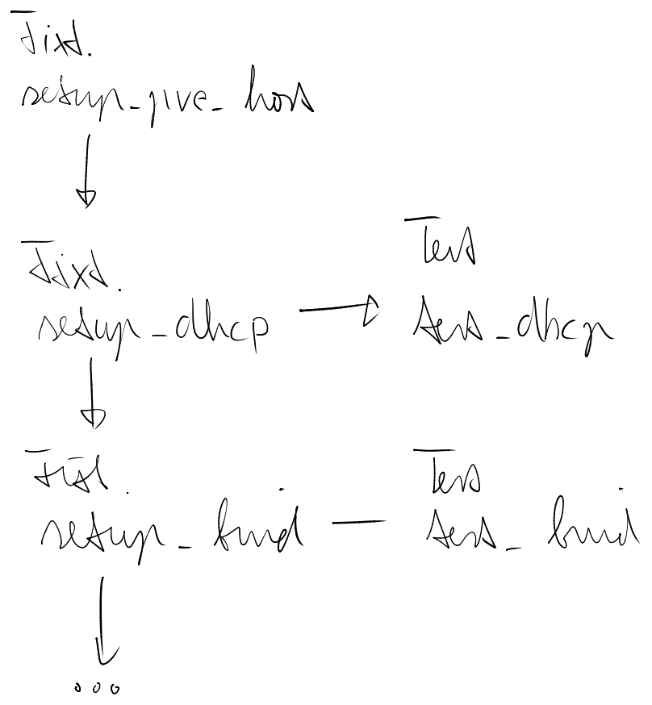

# Test Driven Development

For development you will need a dedicated proxmox cluster with one or more hosts. The testing suite deploys and configures a proxmox cloud with locally build artifacts.

The proxmox cluster you use for testing, needs to be accessible directly and not via jump hosts. Although the testing config supports setting a jump host this is strictly for testing the functions, the tests themselfes still need direct access and dont support proxying.

## E2E Architecture

Pytest is our core testing framework, in combination with ansible_runner and the terraform cli we build and test the entire collection end to end.

Our pytest fixtures contain the core setup of the cloud. And from them branch out one or more tests at every level. The fixtures are called only once (pytest session scope).



Target run pytests against for example test_bind to restrict fixture execution.

## Development

* add this to your `~/.ssh/config`, ssh validation can get annoying when often recreating containers and vms.
```
Host *
    StrictHostKeyChecking no
    UserKnownHostsFile /dev/null
```
* configure your docker `/etc/docker/daemon.json` to accept the local registry for insecure http pushes, followed by `sudo service docker restart`
```json
{
  "insecure-registries":  ["192.168.1.0/24"]
}
```
* install `direnv` and activate it in your local profile (add `eval "$(direnv hook bash)"` to .bashrc)
* create a `pve-cloud` folder and checkout all the repositories you want to make changes to, if you checkout the ansible collections they have to be under `ansible_collections/pve/`
* create a dedicated venv for pve cloud development `python3 -m venv ~/.pve-cloud-dev-venv` and activate `source ~/.pve-cloud-dev-venv/bin/activate`, install the default ansible dependency from the bootstrap section
* create a test environment config yaml (you can find the schema definition in the src folder of the [pytest-pve-cloud repository](https://github.com/Proxmox-Cloud/pytest-pve-cloud)) - forward to the test domain your main dns (you can use `bind_forward_zones` in the pve cloud inventory if your main infrastructure already is a pve cloud)
* create a `.envrc` file with env variables stored for development
```bash
export TDDOG_LOCAL_IFACE= # iface name of you local net ip `ip -4 addr show`. The deployed infrastructure needs your developer machines ip for pulling.
export PVE_CLOUD_TEST_CONF=$(pwd)/test-env-conf.yaml
export ANSIBLE_COLLECTIONS_PATH=$(pwd)
```

the created local dir might look like this:

```
ansible_collections/pve/
  cloud
py-pve-cloud
pve-cloud-controller
.envrc
test-env-conf.yaml
```

1. install build essentails `sudo apt install build-essential python3-dev` (or your distros equivalent)
2. install ansible as described in the [bootstrap section](bootstrap.md) and also run the control node setup
3. launch local registries for watchdog rebuilds and fast deployment
```bash
docker run -d -p 5000:5000 --name pxc-local-registry -e REGISTRY_STORAGE_DELETE_ENABLED=true registry:3 # local docker registry
docker run -d -p 8088:8080 --name pxc-local-pypi pypiserver/pypiserver:latest run -P . -a . # local pypi registry without auth
docker run -d --name pxc-local-redis -p 6379:6379 redis:latest # redis broker for triggering dependent builds
```
4. run `tddog --recursive` from your top level created `pve-cloud` folder. This will monitor src folders, rebuild artifacts and their dependants and also run `pip install -e .` on libraries that are needed locally.
5. run the e2e tests:
```bash
pytest -s tests/e2e/ --skip-cleanup 

# you can also target specific steps
pytest -s tests/e2e/test_cloud.py::test_bind --skip-cleanup
```

If you want to develop the terraform provider you need golang installed.

### Kubeconfig access

If you passed `--skip-cleanup` to pytest, the kubespray tests will write a `.test-kubeconfig.yaml` file you can use for lens access to the testing cluster.

## Terraform

Terraform is essential for tracking and managing api calls, but it has a severe limitation that makes it unsuitable for conditional, dynamic creation of resouces. Using count and for_each to conditionally create resources requires the inputs to be statically defined. Using dynamically created values gives you `The "count" value depends on resource attributes that cannot be determined until apply, so Terraform cannot predict how many instances will be created.`.

They suggest using the `-target` option to get around this, however this makes the whole configuration messy and can lead to deadlocks when modifiying / deleting resources that are within this dependency chain.

To properly work around this, they could either make terraform more sophisticated, or you have to write your own provider resources / move into wrappers that are better suited for handeling this, like helm charts.

### Debugging/Direct access

The testing suite will write a sourceable `.debug.env` file inside the `test/scenarios/...` folder. With bash `source` function on that env file you can afterwards use the terraform cli for direct apply/plan/destroy operations.

To debug the contents of a module use `terraform console -target=module.XYZ` and then you can directly access resouces without the module prefix.

## VSCode Pytest debug

if you want to attach a debugger to the tests you can use the vscode python debug extension.

create a `.testenv` file with the same variables as the `.envrc` alongside it in your pve-cloud folder

the settings.json for vscode python debug should look something like this:

```json
{
  "python.testing.pytestArgs": [
    "-s",
    "tests/e2e",
    "--skip-cleanup"
  ],
  "python.testing.unittestEnabled": false,
  "python.testing.pytestEnabled": true,
  "python.testing.cwd": "${workspaceFolder}",
  "python.envFile": "${env:HOME}/pve-cloud/.testenv", // adjust it to the path
  "python.defaultInterpreterPath": "${env:HOME}/.pve-cloud-dev-venv/bin/python"
}
```

Also select your python interpreter to the dev environment bin/python in the vscode command palette.

### Multi-Root Projects

If you want to develop with multiple pve-cloud repositories at the same time you can create a `pve-cloud.code-workspace` file top folder.

Open this file via vscode File/Open Workspace from File...

```json
{
  "folders": [
    { "path": "."},
    { "path": "ansible_collections/pxc/cloud" },
    { "path": "pve-cloud-tf" }
  ],
  "settings": {
    "python.defaultInterpreterPath": "${env:HOME}/.pve-cloud-dev-venv/bin/python"
  }
}
```

This loads the e2e tests from both projects via their settings.json file.